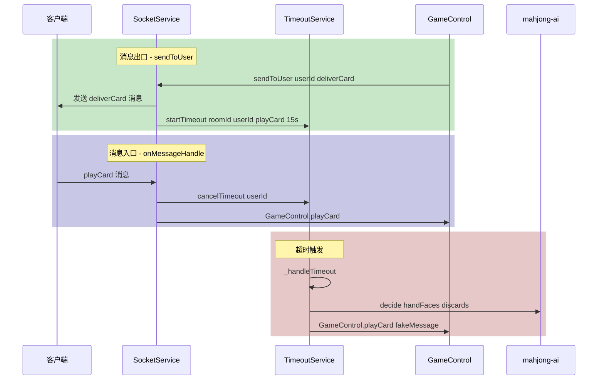

# 服务端超时托管出牌 - 实施计划

## 方案概述

在 **SocketService** 中植入超时逻辑，利用其作为所有消息的唯一出入口，集中管理倒计时的启动和取消。

## 改动文件清单

| 文件 | 改动类型 | 说明 |
|------|----------|------|
| `core/socket/SocketService.js` | 修改 | 核心：在消息入口/出口拦截，启动/取消倒计时 |
| `core/services/TimeoutService.js` | 微调 | 超时时间配置、roomId获取方式 |
| `core/services/RoomService.js` | 小改 | disbandRoom 中清理定时器 |

## 详细改动

### 1. SocketService.js

#### 1a. 引入 TimeoutService

```js
const TimeoutService = require("@coreServices/TimeoutService");
```

#### 1b. onMessageHandle - 消息入口拦截（取消倒计时）

在 `onMessageHandle` 方法中，解析消息后、调用 GameControl 之前，判断是否为游戏操作类型：

```js
// 需要取消超时的操作类型
const CANCEL_TIMEOUT_TYPES = ['playCard', 'peng', 'gang', 'win', 'pass'];

async onMessageHandle(message, userId){
    if (message === 'ping') {
        this.sendHeartBeat(userId);
    } else if(Utils.isJSON(message)) {
        const parseMessage = JSON.parse(_.cloneDeep(message));
        
        // ★ 新增：收到客户端操作，取消该玩家的超时定时器
        if (CANCEL_TIMEOUT_TYPES.includes(parseMessage?.type)) {
            TimeoutService.cancelTimeout(userId);
        }
        
        if(_.isFunction(GameControl[parseMessage?.type])){
            GameControl[parseMessage?.type](parseMessage, this)
        }
    }
}
```

#### 1c. sendToUser - 消息出口拦截（启动倒计时）

在 `sendToUser` 方法中，发送消息后，判断是否需要启动超时：

```js
sendToUser(userId, message, data, type) {
    this.client.clients.forEach(ws => {
        if (ws.userId === userId) {
            // ... 原有逻辑不变 ...
            ws.send(stringify({message, data: userData, type}));
        }
    });
    
    // ★ 新增：发送后启动超时定时器
    if (type === 'deliverCard' && data.playerId === userId) {
        // 轮到该玩家摸牌/出牌，启动15秒倒计时
        const roomId = _.get(data, `roomInfo.${userId}.roomId`);
        if (roomId) {
            TimeoutService.startTimeout(roomId, userId, 'playCard', { roomInfo: data.roomInfo, gameInfo: data.gameInfo });
        }
    } else if (type === 'operate' && data.playerId === userId) {
        // 碰/杠/胡提示，启动8秒倒计时
        const roomId = _.get(data, `roomInfo.${userId}.roomId`);
        if (roomId) {
            TimeoutService.startTimeout(roomId, userId, 'operate', {
                operateType: data.operateType,
                cardNum: data.cardNum,
                roomInfo: data.roomInfo,
                gameInfo: data.gameInfo
            });
        }
    }
}
```

**关键点**：`data.playerId === userId` 确保只对目标玩家启动倒计时，不会误触发给其他玩家的广播。

### 2. TimeoutService.js

#### 2a. 超时时间调整

```js
const TIMEOUT_CONFIG = {
    playCard: 15000,   // 出牌超时 15秒（不变）
    operate: 8000,     // 碰/杠/胡决策超时 8秒（从12秒改为8秒）
};
```

#### 2b. _handleTimeout 中 roomId 获取方式

当前代码通过 `RoomService.getRoomInfo(roomId)` 获取房间信息，roomId 来自 `startTimeout` 时传入的参数，这个逻辑已经正确，无需修改。

但需要确认 `_autoOperate` 中 `data.roomInfo` 的使用——因为超时触发时 `data.roomInfo` 可能已经过时，应该重新从 RoomService 获取最新数据：

```js
_autoOperate(roomId, playerId, data, roomInfo) {
    // roomInfo 参数已经是最新数据（从 _handleTimeout 中获取）
    // 但 data.roomInfo 可能过时，需要使用 roomInfo 参数而非 data.roomInfo
    // ... 现有逻辑基本不变，但确保使用传入的 roomInfo 参数
}
```

### 3. RoomService.js

#### 3a. disbandRoom 中清理定时器

```js
disbandRoom: function (roomId) {
    // ★ 新增：清理该房间所有玩家的超时定时器
    const TimeoutService = require("@coreServices/TimeoutService");
    TimeoutService.cancelAllByRoom(roomId);
    
    // ... 原有逻辑不变 ...
}
```

## 数据流图



## 注意事项

1. **机器人不触发超时**：TimeoutService.isRobot() 已有判断，robot_ 前缀的玩家跳过
2. **新倒计时覆盖旧的**：startTimeout 内部先 cancelTimeout 再创建新的
3. **超时后走完整业务逻辑**：通过 GameControl.playCard/peng/gang/win/pass 调用，不绕过校验
4. **data.roomInfo 可能过时**：超时触发时应从 RoomService 获取最新数据
5. **断线玩家**：超时已在 sendToUser 时启动，断线后客户端收不到消息，超时自然触发AI接管
